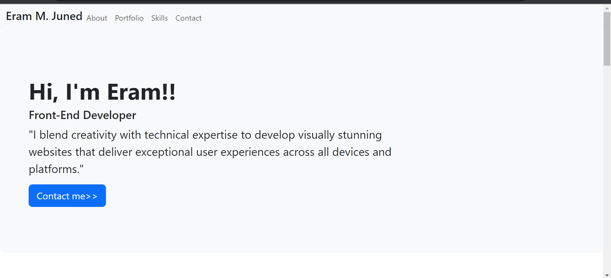
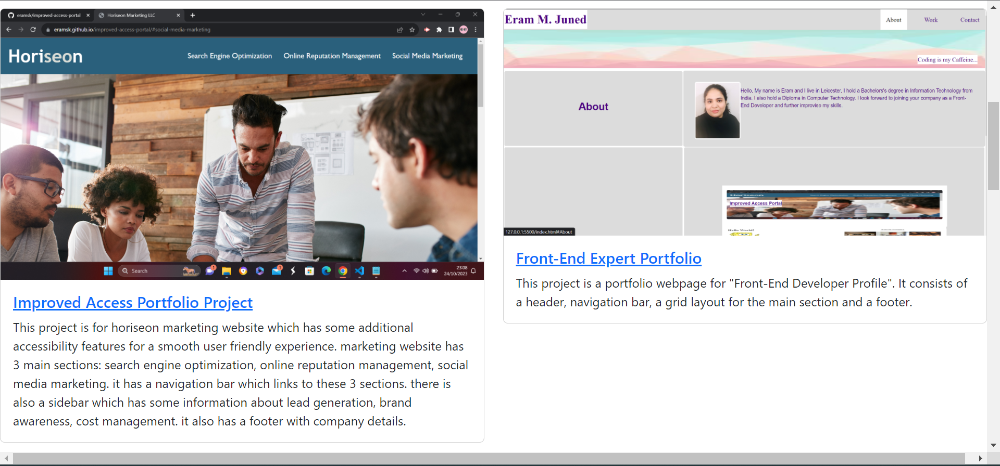
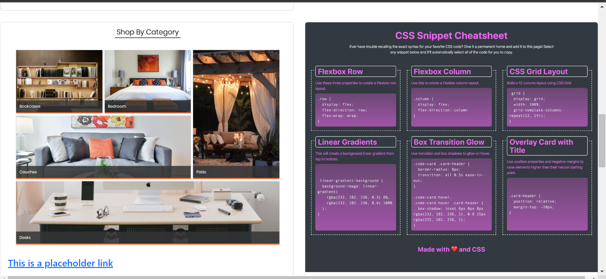
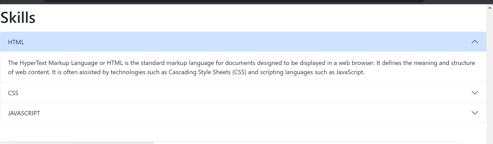
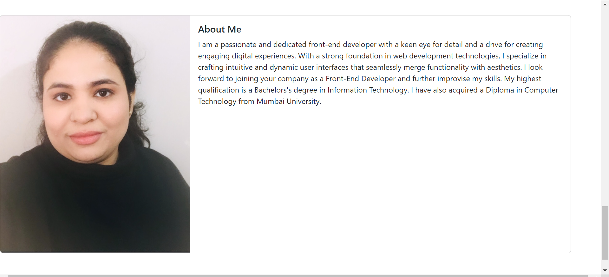
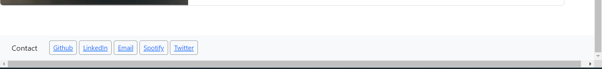

# Bootstrap-Portfolio
This repository is for a front-end expert portfolio using Bootstrap.
It consists of a navigation bar, a grid card layout for the portfolio section an about me section, and a contact footer.

# navigation bar 
this contains 4 sections using the unordered list: about portfolio skills and contact.
when clicked the webpage scrolls to the respective section.

# a jumbotron 
this section contains a small intro about me and what i do.

# grid card layout
the grid card layout is divided into 4 sections using bootstrap code.
the cards display project screenshots and are titled with a link to the gitHub repository.
added placeholder link for projects that are still work in progress.

# contact footer
this contains 5 options for all the different contact and social media pages.
when clicked a new page opens with the respective website.

# screenshots of the website:

# repository name: eramsk/Bootstrap-Portfolio

# github link: https://eramsk.github.io/Bootstrap-Portfolio/
